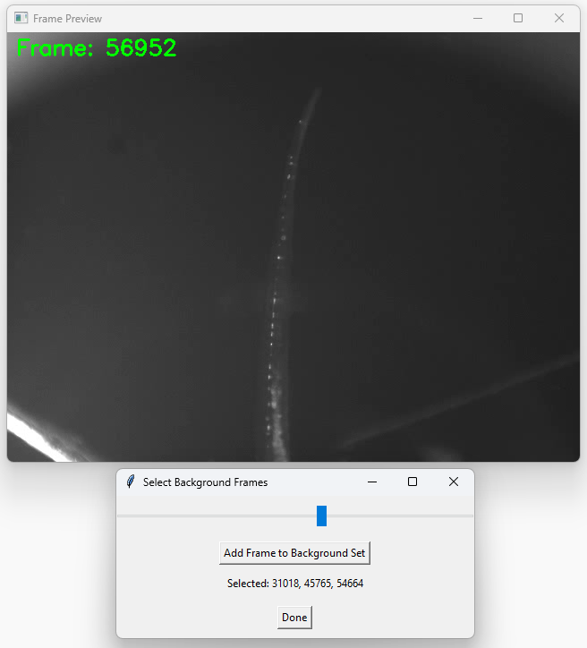
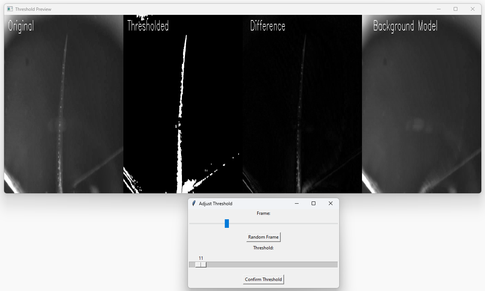

# Background Subtraction for Videos

A simple GUI for performing background subtraction of videos. You can manually select frames to buil a background model (median of frames).
This background model will be subtracted from all frames of the video. You can then set a threshold for removing the background pixel you dont want to keep.

This app was developed to preprocess videos of zebrafish for tail tracking in ZebraZoom. But it can be used for any type of video. It has only been tested on Windows.

## Setup
It is based on the OpenCV package and ffmpeg. You can get ffmpeg here: 

https://ffmpeg.org/

Make sure to set the correct path to your ffmpeg.exe in the "bg_subtraction.py" file
Open the file in a editor and modifiy this line:

ffmpeg_path = r"Your\Path\...\ffmpeg\bin\ffmpeg.exe"


If you are using Anaconda or something similar:

Create a new enviroment:
```bash
conda create --name bg_sub
conda activate bg_sub
conda install pip
pip install opencv-python
pip install tqdm
```

Now go to the directory of the "bg_subtraction.py" file and run it:
```bash
python bg_subtraction.py
```

## Features
- Subtract Background from Video Files
- Select Frames you want to use for the background model
- Adjust the threshold manually in the preview mode
- After subtracting the background the new video will be stored using ffmpeg


<br>


## Update
There is now a second version available. Here the user can select a frame with the object of interest (e.g. the tail) in the default position (e.g. tail in the center)
and a frame where the object of interest (e.g. the tail) is clearly off center.
The user is asked to draw the outline of the object of interest in both frames. This information is then used to generate a background model for subtraction.
If you want to try this out, run the file "bg_subtraction_cutout_method.py".


----------
Nils Brehm - 2025